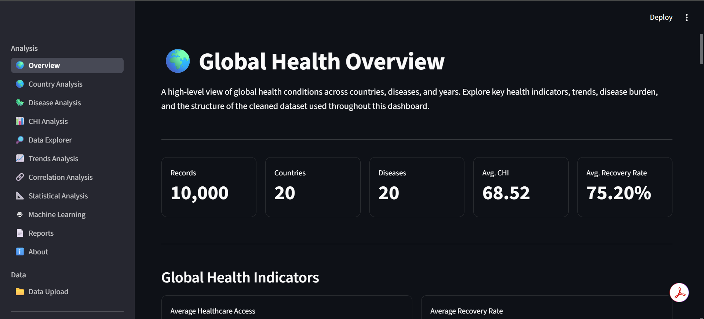
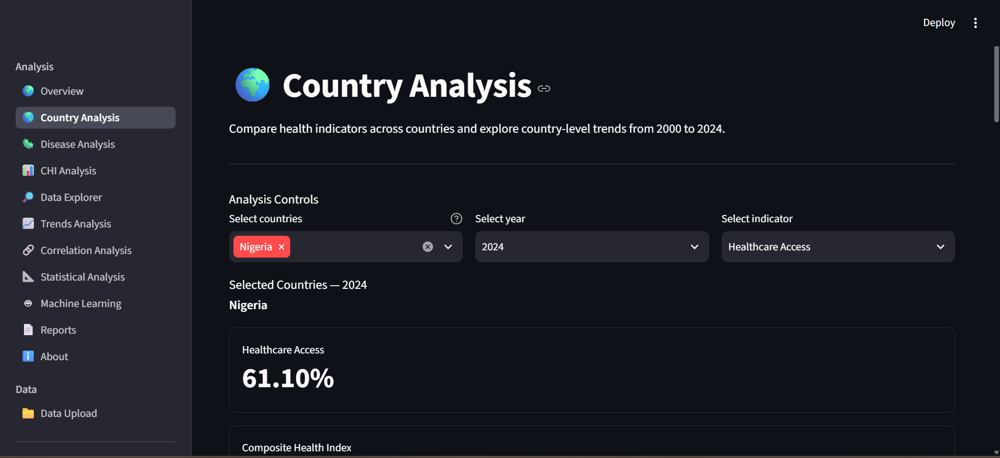
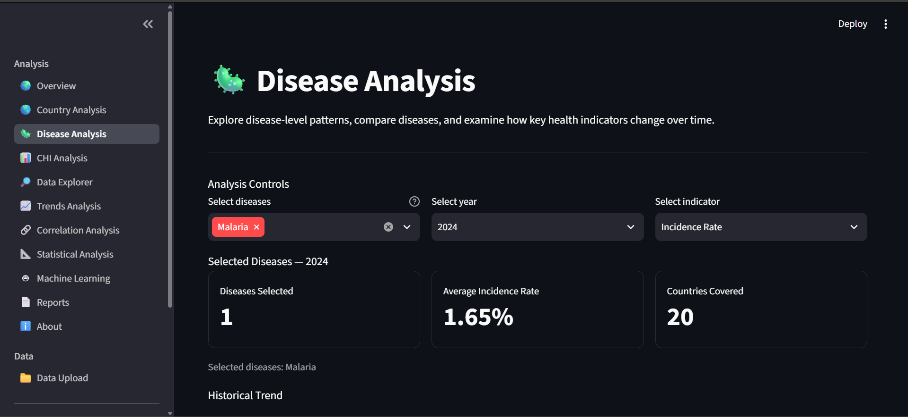
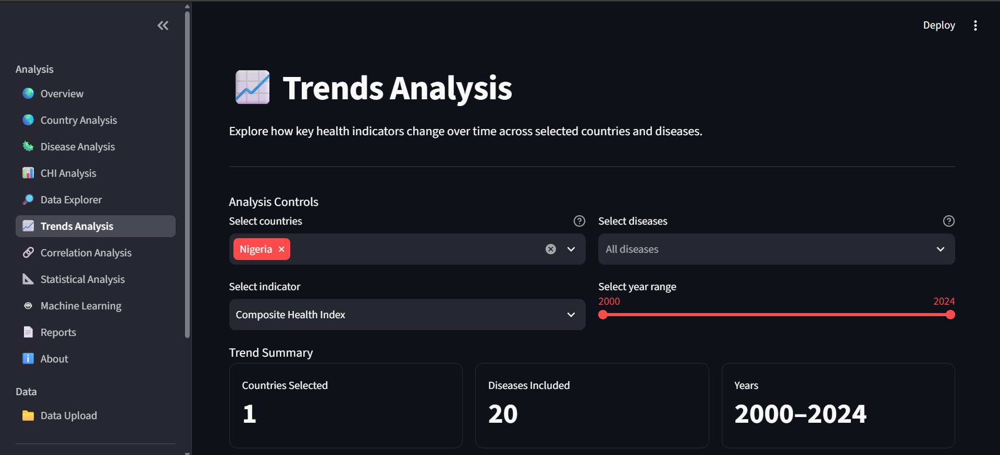
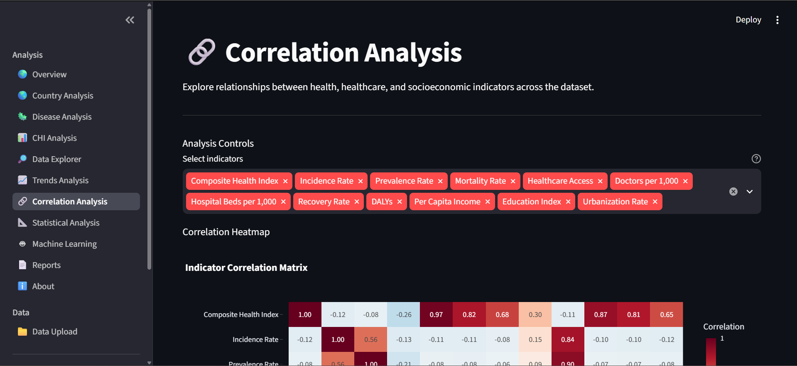
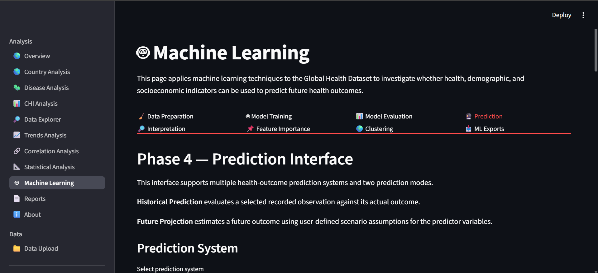
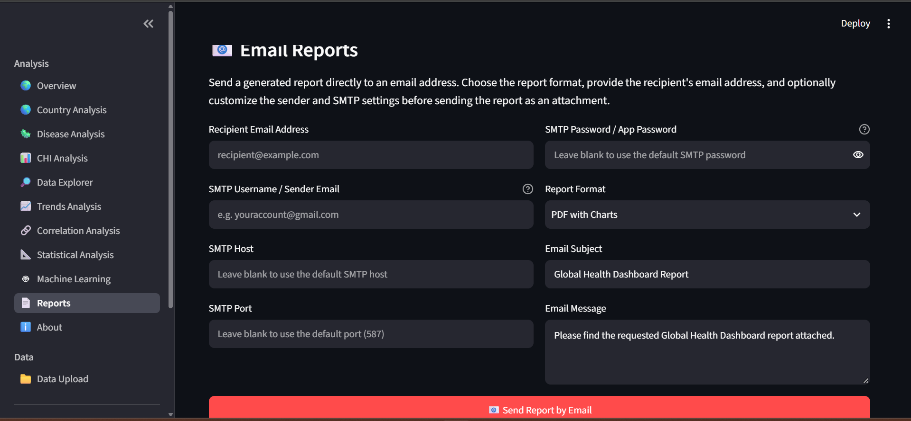

# 🌍 Global Health Dashboard


An end-to-end **Global Health Analytics and Machine Learning application** for exploring health indicators, disease patterns, country-level differences, statistical relationships, trends, predictive models, and analytical reports.

The project combines a reproducible **data preparation and validation pipeline** with an interactive **Streamlit dashboard**, statistical analysis, machine learning, reporting, and export capabilities.

> **Important:** The Global Health Dataset used in this project is **synthetic data** created for analytical, educational, and software-development purposes. It should not be interpreted as real-world epidemiological statistics, medical evidence, official country rankings, or validated health forecasts.

---

## 📑 Table of Contents

* [Project Overview](#-project-overview)
* [Project Objectives](#-project-objectives)
* [Key Features](#-key-features)

  * [Interactive Dashboard](#interactive-dashboard)
  * [Country Analysis](#country-analysis)
  * [Disease Analysis](#disease-analysis)
  * [Trend Analysis](#trend-analysis)
  * [Statistical Analysis](#statistical-analysis)
  * [Correlation Analysis](#correlation-analysis)
  * [Composite Health Index Analysis](#composite-health-index-analysis)
  * [Machine Learning](#machine-learning)
  * [Data Explorer](#data-explorer)
  * [Reports and Exports](#reports-and-exports)
  * [Data Upload and Validation](#data-upload-and-validation)
* [Dataset Overview](#-dataset-overview)
* [Data Grain and Analytical Design](#-data-grain-and-analytical-design)
* [Data Preparation Pipeline](#-data-preparation-pipeline)
* [Dashboard Pages](#-dashboard-pages)
* [Machine Learning Workflow](#-machine-learning-workflow)
* [Reporting and Export Architecture](#-reporting-and-export-architecture)
* [Project Structure](#-project-structure)
* [Technology Stack](#-technology-stack)
* [Installation](#-installation)
* [Running the Application](#-running-the-application)
* [Using the Dashboard](#-using-the-dashboard)
* [Screenshots](#-screenshots)
* [Data Quality and Missing Values](#-data-quality-and-missing-values)
* [Statistical and Analytical Limitations](#-statistical-and-analytical-limitations)
* [Testing and Error Handling](#-testing-and-error-handling)
* [Performance and Caching](#-performance-and-caching)
* [Reproducibility](#-reproducibility)
* [Future Development](#-future-development)
* [License](#-license)
* [Author](#-author)

---

# 🌍 Project Overview

The **Global Health Dashboard** is an end-to-end data analytics project built around a synthetic global health dataset covering multiple countries, diseases, years, healthcare indicators, socioeconomic variables, and health outcomes.

The project demonstrates the complete journey from **raw data to an interactive analytical product**:

```text
Raw Dataset
     ↓
Data Audit
     ↓
Cleaning & Transformation
     ↓
Validation
     ↓
Exploratory Analysis
     ↓
Statistical Analysis
     ↓
Visualization
     ↓
Machine Learning
     ↓
Reporting & Exports
     ↓
Interactive Dashboard
```

The project consists of two major layers:

### 1. Data Engineering Layer

Located primarily in:

```text
src/
```

This layer handles:

* Data extraction
* Text cleaning
* Numeric cleaning
* Missing-value investigation
* Validation
* Auditing
* Pipeline orchestration
* Validation reporting
* Export of processed data

### 2. Analytics Application Layer

Located in:

```text
global_health_web_app/
```

This layer provides:

* Interactive dashboards
* Country analysis
* Disease analysis
* Trend analysis
* Correlation analysis
* Statistical analysis
* Composite Health Index analysis
* Machine learning
* Country clustering
* Data exploration
* Reports
* Data exports
* Application documentation

---

# 🎯 Project Objectives

The project was designed to demonstrate an end-to-end approach to health-data analytics, including:

* Preparing raw structured data for analysis
* Investigating data quality before modelling
* Preserving meaningful missing values
* Exploring disease-level patterns
* Comparing country-level health indicators
* Analysing trends over time
* Measuring relationships between health and socioeconomic indicators
* Investigating the Composite Health Index
* Performing descriptive statistical analysis
* Identifying statistical outliers
* Training and evaluating machine-learning models
* Generating historical predictions
* Producing future scenario projections
* Performing country clustering
* Generating analytical reports
* Exporting analytical results
* Providing a user-friendly interactive interface

---

# 🚀 Key Features

## Interactive Dashboard

The Streamlit application provides a centralized interface through which users can explore the dataset without directly interacting with Python or Pandas.

Users can:

* Review dataset coverage
* Explore individual countries
* Compare diseases
* Examine historical trends
* Investigate correlations
* Analyse statistical distributions
* Study the Composite Health Index
* Train machine-learning models
* Generate predictions
* Explore country clusters
* Export results
* Generate reports

---

## Country Analysis

The Country Analysis module provides country-level exploration of health indicators.

It supports:

* Country selection
* Year selection
* Indicator selection
* Country-level KPIs
* Historical trends
* Country comparisons
* Disease coverage
* Country-level tables

This allows users to investigate how selected health indicators vary between countries and across time.

---

## Disease Analysis

The Disease Analysis module focuses on disease-level patterns.

Users can:

* Select diseases
* Select a year
* Select a health indicator
* Compare selected diseases
* Examine historical disease trends
* View country-level disease data

Available indicators include measures such as:

* Incidence Rate
* Prevalence Rate
* Mortality Rate
* Recovery Rate
* DALYs
* Composite Health Index

---

## Trend Analysis

The Trends Analysis module allows users to investigate how health indicators change over time.

Users can filter by:

* Country
* Disease
* Year range
* Indicator

The module provides historical trend visualizations and summarized country-level trend data.

---

## Statistical Analysis

The Statistical Analysis module provides descriptive and distributional analysis for selected indicators.

It includes:

* Mean
* Median
* Standard deviation
* Minimum
* Maximum
* Variance
* Skewness
* Kurtosis
* Quartiles
* Interquartile range
* IQR-based outlier detection

Visualizations include:

* Histograms
* Box plots
* Yearly trend charts
* Country distributions

The application uses the **1.5 × IQR rule** to identify statistical outliers.

---

## Correlation Analysis

The Correlation Analysis module allows users to examine linear relationships between numerical health, healthcare, and socioeconomic indicators.

It provides:

* Correlation matrix
* Interactive heatmap
* Correlation coefficient table
* Strongest relationship pairs
* Relationship classifications
* Composite Health Index relationships
* Interpretation guidance

Correlation values are treated as measures of **association**, not evidence of causation.

---

## Composite Health Index Analysis

The Composite Health Index (CHI) is a project-specific health indicator used for deeper country-level analysis.

The CHI module includes:

* CHI overview
* CHI trends
* CHI relationships
* Regression analysis
* Residual analysis
* Feature importance
* Reverse-engineering analysis

A key analytical consideration is that CHI is conceptually a **country-year measure**, rather than a disease-level measure.

Therefore, analyses involving CHI are designed to respect its appropriate analytical grain.

---

## Machine Learning

The Machine Learning module provides an end-to-end modelling environment.

It includes:

* Data preparation
* Model training
* Model evaluation
* Prediction
* Historical prediction
* Future projection
* Manual scenario analysis
* Prediction interpretation
* Feature importance
* Country clustering
* Machine-learning exports

### Model Families

The project includes regression models such as:

* Linear Regression
* Random Forest Regression
* Gradient Boosting Regression

### Evaluation Metrics

Model evaluation includes metrics such as:

* R²
* Adjusted R² where applicable
* Mean Absolute Error (MAE)
* Root Mean Squared Error (RMSE)

### Prediction

The application supports prediction workflows for selected health indicators, including:

* Historical predictions
* Future projections
* Manual scenarios

Predictions are model-generated estimates based on the supplied synthetic dataset and should not be interpreted as validated real-world health forecasts.

### Feature Importance

Feature importance analysis helps identify which model inputs contribute most strongly to model predictions.

### Country Clustering

Countries can be grouped according to selected health, healthcare, and socioeconomic characteristics.

The clustering workflow provides:

* Cluster assignments
* Cluster summaries
* Country membership
* PCA-based visualization

Clusters are exploratory analytical groupings and should not be interpreted as official country classifications.

---

## Data Explorer

The Data Explorer provides a more flexible way to inspect the underlying dataset.

Users can:

* Filter records
* Select countries
* Select diseases
* Select years
* Explore filtered records
* Review summary information
* Export filtered datasets

Supported exports include:

* CSV
* Excel

---

## Reports and Exports

The project provides several categories of downloadable output.

### Dataset Exports

* Cleaned Dataset → CSV
* Filtered Dataset → CSV
* Filtered Dataset → Excel

### Analysis Exports

* Trend Analysis
* Correlation Analysis
* Statistical Analysis
* CHI Analysis

### Machine Learning Exports

* Model Evaluation
* Predictions
* Feature Importance
* Country Clustering

### Reports

The reporting system supports:

* PDF reports
* PDF reports with charts
* Interactive HTML reports
* Email-based report delivery

---

## Data Upload and Validation

The Data Upload module provides a controlled workflow for introducing datasets into the application.

The project supports structured data sources including:

* CSV
* Excel
* SQLite

Uploaded datasets are checked for structural validity and required fields before being used for downstream analysis.

The application also provides user-facing error messages for invalid or unsupported inputs.

---

# 📊 Dataset Overview

The project uses the:

**Global Health Dataset (2000–2024)**

The synthetic dataset contains approximately:

* **20 countries**
* **20 diseases**
* **25 years**
* **10,000+ records**
* **30 columns**

### Major Data Categories

| Category          | Example Variables                                             |
| ----------------- | ------------------------------------------------------------- |
| Identification    | Country, Year, Disease                                        |
| Disease metrics   | Incidence, Prevalence, Mortality                              |
| Population impact | Population Affected, DALYs                                    |
| Healthcare        | Healthcare Access, Doctors per 1,000, Hospital Beds per 1,000 |
| Outcomes          | Recovery Rate                                                 |
| Health index      | Composite Health Index                                        |
| Socioeconomic     | Per Capita Income, Education Index, Urbanization              |

The original dataset is stored in:

```text
data/raw/Global Health Dataset.csv
```

The processed dataset is stored in:

```text
data/processed/Global Health Dataset_cleaned.csv
```

The validation output is stored in:

```text
data/processed/validation_report.csv
```

---

# 🔬 Data Grain and Analytical Design

One of the most important analytical considerations in this project is that different variables exist at different levels of observation.

## Disease-Level Grain

Most disease-specific indicators are represented at:

```text
Country × Year × Disease
```

Examples include:

* Incidence Rate
* Prevalence Rate
* Mortality Rate
* Population Affected
* DALYs
* Recovery Rate

## Country-Year Grain

The Composite Health Index is treated conceptually as:

```text
Country × Year
```

This distinction matters when performing:

* Aggregation
* Correlation analysis
* Regression
* Statistical analysis
* Machine learning
* Country comparisons

The application therefore avoids treating repeated country-year measures as independent disease-level observations when the analytical question requires country-year aggregation.

---

# 🧹 Data Preparation Pipeline

The project includes a modular data-cleaning and validation pipeline under:

```text
src/
```

The general workflow is:

```text
Raw Dataset
     ↓
Extraction
     ↓
Audit
     ↓
Text Cleaning
     ↓
Numeric Cleaning
     ↓
Missing-Value Investigation
     ↓
Transformation
     ↓
Validation
     ↓
Validation Report
     ↓
Cleaned Dataset
```

## Pipeline Modules

### `config.py`

Contains configuration and pipeline-related definitions.

### `extract.py`

Handles source-data extraction and loading.

### `text_cleaning.py`

Handles textual and categorical cleaning and standardization.

### `numeric_cleaning.py`

Handles numerical conversion and cleaning.

### `missing_values.py`

Investigates missing values and supports the missing-data workflow.

### `pipeline.py`

Coordinates the individual cleaning and validation stages.

### `validation.py`

Performs structural and data-quality validation.

### `validation_report.py`

Produces validation reporting output.

### `export.py`

Handles export of processed datasets.

### `utils/audit.py`

Provides auditing utilities for inspecting the dataset and pipeline results.

---

# 📑 Dashboard Pages

The Streamlit application contains the following pages:

| Page                         | Purpose                                           |
| ---------------------------- | ------------------------------------------------- |
| `01_Overview.py`             | Dataset overview and high-level health indicators |
| `02_Country_Analysis.py`     | Country-level analysis and comparisons            |
| `03_Disease_Analysis.py`     | Disease-level trends and comparisons              |
| `04_CHI_Analysis.py`         | Composite Health Index analysis                   |
| `05_Data_Explorer.py`        | Interactive dataset exploration                   |
| `06_Data_Upload.py`          | Dataset upload and validation                     |
| `07_Trends_Analysis.py`      | Historical trend analysis                         |
| `08_Correlation_Analysis.py` | Correlation analysis                              |
| `09_Statistical_Analysis.py` | Statistical analysis and outlier detection        |
| `10_Machine_Learning.py`     | Machine learning and prediction                   |
| `11_Reports.py`              | Reporting and exports                             |
| `12_About.py`                | Project information and documentation             |

---

# 🤖 Machine Learning Workflow

The machine-learning workflow is primarily implemented through:

```text
global_health_web_app/
└── utils/
    └── ml_models.py
```

The general workflow is:

```text
Dataset
   ↓
Feature Selection
   ↓
Data Preparation
   ↓
Model Training
   ↓
Model Evaluation
   ↓
Historical Prediction
   ↓
Future / Scenario Projection
   ↓
Interpretation
   ↓
Feature Importance
   ↓
Country Clustering
```

The modelling workflow is designed to separate target variables from predictors and reduce inappropriate target leakage.

Future projections are explicitly model-based outputs rather than validated forecasts of real-world health outcomes.

---

# 📄 Reporting and Export Architecture

Reporting functionality is separated into dedicated utility modules:

```text
global_health_web_app/
└── utils/
    ├── email_report.py
    ├── html_report.py
    └── pdf_report.py
```

This separation keeps reporting logic independent from individual dashboard pages.

The reporting system can generate analytical outputs from the current application context and provide them as downloadable files or email reports.

---

# 🗂️ Project Structure

```text
C:.
├── .gitignore
├── LICENSE
├── project_tree.txt
├── README.md
├── test_ml.py
│
├── .history/
├── .venv/
├── __pycache__/
├── *.pyc
│
├── data
│   ├── processed
│   │   ├── Global Health Dataset_cleaned.csv
│   │   └── validation_report.csv
│   │
│   ├── raw
│   │   └── Global Health Dataset.csv
│   │
│   └── screenshots
│       ├── config_module.png
│       ├── export_module.png
│       ├── extract_module.png
│       ├── Global Health Dataset cleaned_csv.png
│       ├── Global Health Dataset raw_csv.png
│       ├── main_module.png
│       ├── missing_values_module.png
│       ├── numeric_cleaning_module.png
│       ├── pipeline_module.png
│       ├── text_cleaning_module.png
│       ├── validation_module.png
│       ├── validation_report_csv.png
│       └── validation_report_module.png
│
├── database
│
├── global_health_web_app
│   ├── .env
│   ├── .gitignore
│   ├── app.py
│   ├── README.md
│   ├── requirements.txt
│   │
│   ├── app
│   │   ├── main.py
│   │   ├── __init__.py
│   │   ├── components
│   │   ├── pages
│   │   ├── services
│   │   └── utils
│   │
│   ├── assets
│   │   ├── about.png
│   │   ├── chi_analysis.png
│   │   ├── corr_analysis.png
│   │   ├── country_analysis.png
│   │   ├── data_explorer.png
│   │   ├── data_upload.png
│   │   ├── disease_analysis.png
│   │   ├── machine_learning.png
│   │   ├── overview.png
│   │   ├── reports.png
│   │   ├── stats_analysis.png
│   │   └── trends_analysis.png
│   │
│   ├── data
│   │   └── Global Health Dataset_cleaned.csv
│   │
│   ├── pages
│   │   ├── 01_Overview.py
│   │   ├── 02_Country_Analysis.py
│   │   ├── 03_Disease_Analysis.py
│   │   ├── 04_CHI_Analysis.py
│   │   ├── 05_Data_Explorer.py
│   │   ├── 06_Data_Upload.py
│   │   ├── 07_Trends_Analysis.py
│   │   ├── 08_Correlation_Analysis.py
│   │   ├── 09_Statistical_Analysis.py
│   │   ├── 10_Machine_Learning.py
│   │   ├── 11_Reports.py
│   │   └── 12_About.py
│   │
│   ├── styles
│   │   └── style.css
│   │
│   ├── tests
│   │
│   └── utils
│       ├── calculations.py
│       ├── charts.py
│       ├── data_loader.py
│       ├── email_report.py
│       ├── helpers.py
│       ├── html_report.py
│       ├── ml_models.py
│       ├── pdf_report.py
│       ├── style.py
│       └── __init__.py
│
├── notebooks
│   ├── 01_exploratory_data_analysis.ipynb
│   └── rough.ipynb
│
├── reports
│
└── src
    ├── config.py
    ├── export.py
    ├── extract.py
    ├── main.py
    ├── missing_values.py
    ├── numeric_cleaning.py
    ├── pipeline.py
    ├── test.py
    ├── text_cleaning.py
    ├── validation.py
    ├── validation_report.py
    ├── __init__.py
    │
    └── utils
        ├── audit.py
        └── __init__.py
```

### Directory Responsibilities

| Directory                       | Purpose                                                 |
| ------------------------------- | ------------------------------------------------------- |
| `data/raw/`                     | Original raw dataset                                    |
| `data/processed/`               | Cleaned dataset and validation output                   |
| `data/screenshots/`             | Data-pipeline screenshots                               |
| `src/`                          | Data preparation, validation, and pipeline code         |
| `global_health_web_app/`        | Streamlit application                                   |
| `global_health_web_app/pages/`  | Dashboard pages                                         |
| `global_health_web_app/utils/`  | Analytics, charts, ML, reporting, and styling utilities |
| `global_health_web_app/assets/` | Dashboard screenshots and visual assets                 |
| `notebooks/`                    | Exploratory notebooks                                   |
| `database/`                     | Database resources                                      |
| `reports/`                      | Report outputs                                          |

Development-specific directories such as `.venv/`, `.history/`, `__pycache__/`, and compiled `.pyc` files are not required for normal application use.

---

# 🛠️ Technology Stack

## Programming

* Python 3.13

## Data Processing

* Pandas
* NumPy

## Visualization

* Plotly
* Plotly Express
* Streamlit

## Machine Learning

* Scikit-learn
* Linear Regression
* Random Forest Regression
* Gradient Boosting Regression
* PCA

## Data Storage and File Formats

* CSV
* Excel
* SQLite
* JSON

## Reporting

* PDF generation
* HTML reporting
* Email reporting
* CSV export
* Excel export

## Development

* Git
* GitHub
* Virtual environments
* Jupyter Notebook
* Modular Python architecture

---

# 💻 Installation

## 1. Clone the Repository

```bash
git clone <repository-url>
cd <repository-directory>
```

## 2. Create a Virtual Environment

### Windows

```powershell
python -m venv .venv
```

Activate it:

```powershell
.venv\Scripts\activate
```

### macOS / Linux

```bash
python -m venv .venv
source .venv/bin/activate
```

## 3. Install Dependencies

Move into the application directory:

```bash
cd global_health_web_app
```

Install the dependencies:

```bash
pip install -r requirements.txt
```

Then return to the project root:

```bash
cd ..
```

---

# ▶️ Running the Application

From the project root:

```bash
streamlit run global_health_web_app/app.py
```

Streamlit will provide a local URL in the terminal.

Open the URL in your browser to launch the dashboard.

---

# 📘 Using the Dashboard

A recommended workflow is:

1. Start with **Overview** to understand the dataset.
2. Review **Data Upload** if working with a new dataset.
3. Use **Country Analysis** to investigate individual countries.
4. Use **Disease Analysis** to investigate disease-level patterns.
5. Explore the **Composite Health Index**.
6. Use **Trends Analysis** to examine changes over time.
7. Use **Correlation Analysis** to examine relationships between indicators.
8. Use **Statistical Analysis** to investigate distributions and outliers.
9. Use **Data Explorer** for detailed filtering and record-level exploration.
10. Use **Machine Learning** for model training and prediction.
11. Use **Reports** to generate downloadable or email-based outputs.
12. Use **About** for project documentation, scope, privacy information, and usage guidance.

---

# 🖼️ Screenshots

The project includes screenshots from both the interactive dashboard and the underlying data-engineering pipeline.

## Dashboard Overview



## Country Analysis



## Disease Analysis



## Trends Analysis



## Correlation Analysis



## Machine Learning



## Reports



---

## Data Engineering Pipeline

### Raw Dataset


### Cleaned Dataset


### Pipeline


### Validation Report


These screenshots provide visual evidence of both the **data-engineering workflow** and the **final analytics application**.

---

# 🧪 Data Quality and Missing Values

Data quality is treated as an analytical concern rather than simply a preprocessing step.

The pipeline investigates:

* Missing values
* Duplicate records
* Data types
* Text inconsistencies
* Numeric inconsistencies
* Invalid values
* Structural problems
* Country naming consistency
* Disease naming consistency
* Validation rules
* Potential anomalies

## Missing Data Philosophy

The project does **not** automatically fill every missing value simply to make the dataset appear complete.

Missing values may reflect:

* Data availability
* Country-specific coverage
* Disease-specific coverage
* Time-specific coverage
* Collection limitations
* Structural missingness

Therefore, missing values are investigated according to context rather than blindly imputed.

This approach helps reduce the risk of introducing artificial patterns into statistical and machine-learning analyses.

---

# ⚠️ Statistical and Analytical Limitations

This project is an analytics and software-development project, not a clinical or epidemiological decision-support system.

## Synthetic Dataset

The dataset is synthetic.

Therefore:

* Results should not be interpreted as real-world health statistics.
* Relationships should not be used for medical decisions.
* Predictions should not be interpreted as actual forecasts.
* Country comparisons should not be treated as official rankings.

## Correlation Does Not Imply Causation

A strong correlation between two variables does not demonstrate that one variable causes the other.

## Machine-Learning Predictions

Machine-learning outputs are estimates generated from the supplied dataset and model assumptions.

They are not validated medical forecasts.

## Composite Health Index

The Composite Health Index is a project-specific analytical measure.

It is not an official global health ranking or internationally validated health index.

## Outliers

An observation identified using the 1.5 × IQR rule is not automatically an error.

Some statistical outliers may represent legitimate variation within the dataset.

## Analytical Grain

Different variables exist at different levels of observation.

Care must therefore be taken when combining:

```text
Country × Year
```

and:

```text
Country × Year × Disease
```

measurements.

---

# 🧪 Testing and Error Handling

The application has undergone testing across major operational workflows, including:

* Normal application startup
* Data loading
* Dataset upload
* Unsupported file handling
* Malformed file handling
* Missing required columns
* Empty analysis selections
* Insufficient machine-learning data
* Model training
* Model evaluation
* Historical prediction
* Future projection
* Feature importance
* Country clustering
* Report generation
* Email validation
* Export operations
* Page navigation
* Browser refresh
* Streamlit rerun stability

The application is designed to provide user-facing errors and warnings instead of exposing raw Python tracebacks during normal interaction.

---

# ⚡ Performance and Caching

Because Streamlit reruns application code when users interact with controls, the project uses caching selectively to reduce unnecessary computation.

`st.cache_data` is used for reusable or computationally expensive operations such as:

* Dataset metadata preparation
* Filtered analytical datasets
* Statistical calculations
* Correlation matrices
* Trend preparation
* Chart preparation
* Machine-learning preparation
* Export generation
* Report-related processing

Caching is applied selectively rather than indiscriminately so that interactive elements remain responsive without unnecessarily caching simple display operations.

---

# 🔁 Reproducibility

The project emphasizes reproducibility through:

* Programmatic data cleaning
* Modular pipeline components
* Explicit validation rules
* Reusable utility functions
* Cached analytical operations
* Structured dashboard pages
* Dedicated reporting utilities
* Version-controlled source code

The dataset-cleaning workflow is implemented through Python modules rather than manual spreadsheet editing.

This makes the workflow easier to:

* Inspect
* Repeat
* Test
* Debug
* Extend

---

# 🔮 Future Development

Potential future improvements include:

* Additional statistical tests
* More advanced predictive modelling
* Additional machine-learning algorithms
* Expanded feature-selection techniques
* Additional clustering approaches
* Automated scheduled reporting
* Expanded automated testing
* Additional dashboard visualizations
* More advanced data-quality monitoring
* Additional deployment configurations

The current modular architecture is intended to make future extensions easier without requiring a complete rewrite of the application.

---

# 📜 License

This project is distributed under the license included in:

```text
LICENSE
```

Please review the license file for the applicable terms of use and distribution.

---

# 👤 Author

## Chigozie Nnoli

**Data Analyst & Business Intelligence Professional**

### Profiles

* **GitHub:** https://github.com/gozzy15/
* **Portfolio:** https://gozzydanalyst.my.canva.site
* **LinkedIn:** https://www.linkedin.com/in/chigozie-nnoli

---

# 📌 Project Summary

The **Global Health Dashboard** brings together:

* Data engineering
* Data cleaning
* Data validation
* Exploratory data analysis
* Statistical analysis
* Data visualization
* Correlation analysis
* Composite Health Index analysis
* Machine learning
* Predictive modelling
* Country clustering
* Reporting
* Data exports
* Interactive dashboard development

The complete workflow can be summarized as:

```text
                 GLOBAL HEALTH ANALYTICS
                         │
                         ▼
                  ┌──────────────┐
                  │   Raw Data   │
                  └──────┬───────┘
                         │
                         ▼
              ┌─────────────────────┐
              │ Audit & Data Quality │
              └──────────┬──────────┘
                         │
                         ▼
              ┌─────────────────────┐
              │ Cleaning & Validation│
              └──────────┬──────────┘
                         │
                         ▼
                ┌────────────────┐
                │ Exploratory    │
                │ Analysis       │
                └───────┬────────┘
                        │
            ┌───────────┼───────────┐
            ▼           ▼           ▼
       Statistics  Correlations   Trends
            │           │           │
            └───────────┼───────────┘
                        ▼
                ┌────────────────┐
                │ CHI Analysis   │
                └───────┬────────┘
                        │
                        ▼
                ┌────────────────┐
                │ Machine        │
                │ Learning       │
                └───────┬────────┘
                        │
             ┌──────────┼──────────┐
             ▼          ▼          ▼
        Prediction  Clustering  Feature
                               Importance
             │          │          │
             └──────────┼──────────┘
                        ▼
                ┌────────────────┐
                │ Reports &      │
                │ Exports        │
                └───────┬────────┘
                        │
                        ▼
                ┌────────────────┐
                │ Interactive     │
                │ Dashboard       │
                └────────────────┘
```

The project demonstrates an end-to-end approach to transforming structured health data into a reproducible, interactive analytical product while maintaining attention to **data quality, analytical grain, statistical interpretation, machine-learning limitations, and responsible use of synthetic data**.
